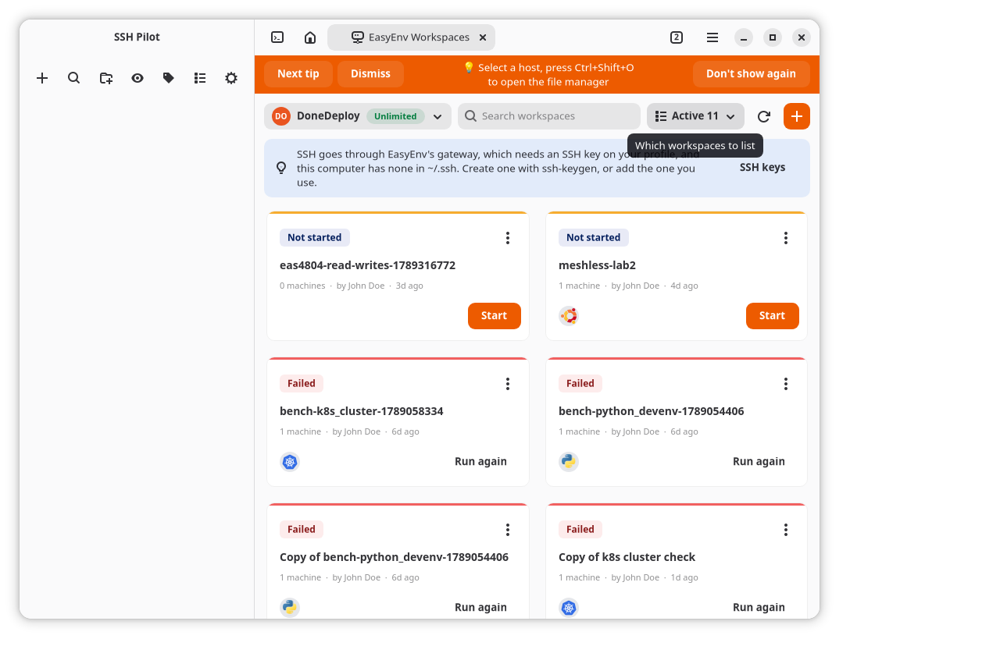
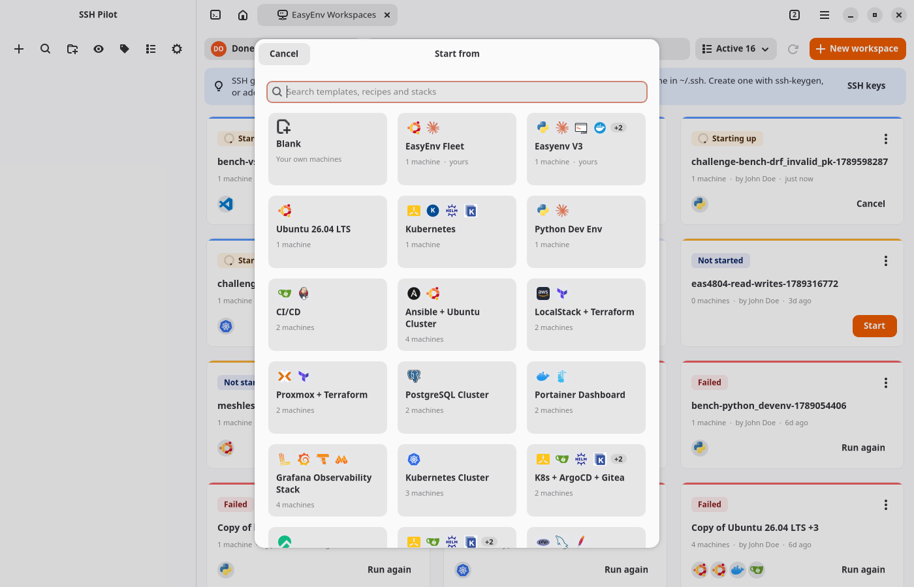
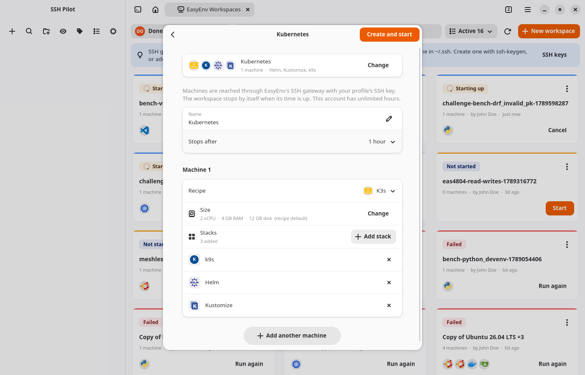
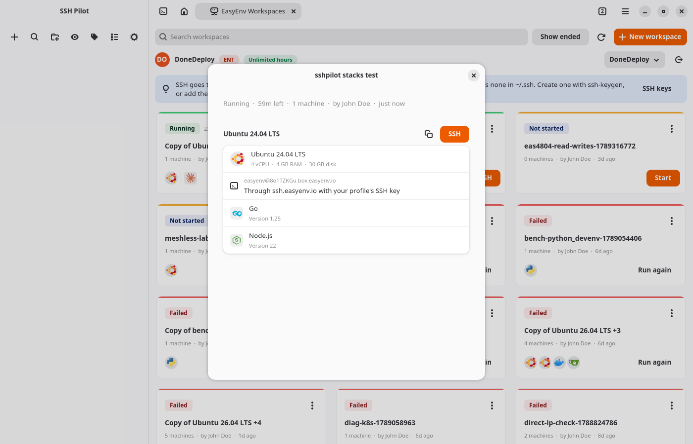
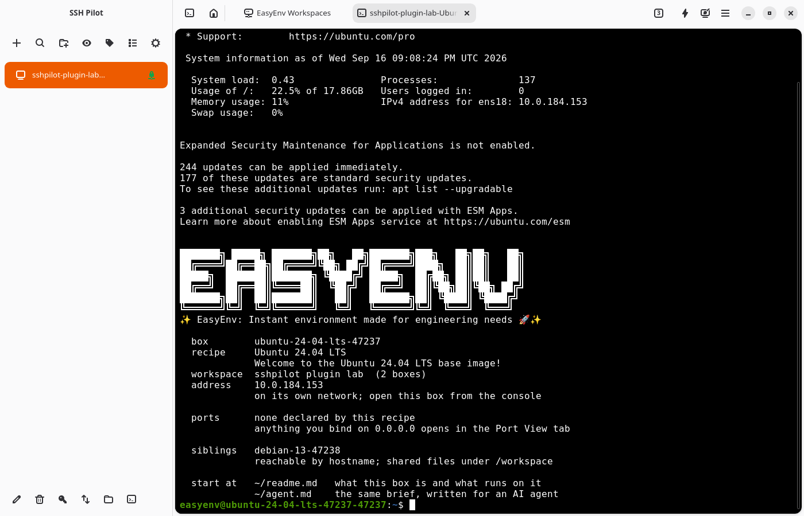

# EasyEnv Workspaces for sshPilot

Real Linux machines in the cloud, one click away in
[sshPilot](https://github.com/mfat/sshpilot).



## What is EasyEnv?

[EasyEnv](https://easyenv.io) gives you real Linux machines on demand. A
**workspace** is one or more machines, each built from a **recipe** (Ubuntu,
Debian, Rocky, a Python or Go toolchain, PostgreSQL, Docker, a Kubernetes
cluster and many more), networked together, and gone when its time is up.
**Templates** set up common combinations in one go, and **stacks** add
languages and tools to a machine.

It is a good fit when you want to:

- try a Linux distribution, a package or a config change without touching your
  own computer;
- test a script, an install guide or an Ansible playbook on a clean machine,
  then throw the machine away;
- stand up a Kubernetes cluster, a database or a CI runner in minutes, to
  learn, to teach, or to reproduce a bug;
- run several machines that talk to each other (a cluster, an app and its
  database);
- give an AI agent a machine of its own instead of your laptop.

**Free to start:** a free EasyEnv account includes **10 hours of machine time
every month**. Sign up at [dashboard.easyenv.io](https://dashboard.easyenv.io);
the plugin shows how much time is left and links to more when you need it.

## What the plugin does

- **Sign in** by pasting the token the EasyEnv dashboard shows you.
- **See your lab hours**, and get a **Buy hours** button when they run low or
  run out.
- **One bar on top**: the account button (hours, switching accounts, SSH
  keys, sign out), search, a filter button (Active, Ended or All, with counts), and New
  workspace. It sheds labels in a narrow window rather than widening it.
- **Workspaces as cards**, like the dashboard's: status, time left, who made
  it, and the logos of its recipes and stacks.
- **Create workspaces** in two steps. First, **start from** a template (a
  searchable gallery of the dashboard's templates, the account's own first)
  or from blank; then the machines, with the choice folded into one row
  and a Change button to go back. Each machine has its own recipe
  (searchable, with logos), its **size** (vCPU, RAM, disk, from the recipe's
  default up to the plan's cap, or fixed where the plan fixes it), and its
  **stacks**, added one by one from a searchable list (languages come with
  a version).
- **Details** (click a card): each machine's recipe, size, stacks and SSH
  address.
- **SSH into any machine** with one click; a workspace with several machines
  asks which. Stop, delete, start, or run an ended workspace again.

Machines are reached through EasyEnv's SSH gateway, exactly as the dashboard's
own command does:

```sh
ssh -J easyenv@ssh.easyenv.io easyenv@AbC123.box.easyenv.io
```

No VPN, no public IP, nothing to install: the plugin uses the Python standard
library only.

## Install

From sshPilot: **Preferences ▸ Plugins ▸ Browse**, find **EasyEnv
Workspaces**, install, and restart sshPilot.

By hand, from a release:

```sh
mkdir -p ~/.local/share/sshpilot/plugins/easyenv-workspaces
unzip easyenv-workspaces.zip -d ~/.local/share/sshpilot/plugins/easyenv-workspaces
```

or from a checkout:

```sh
cp -r easyenv_workspaces ~/.local/share/sshpilot/plugins/easyenv-workspaces
```

Then enable it under **Preferences ▸ Plugins** and restart sshPilot. The page is
under **EasyEnv Workspaces** in the app menu.

## Signing in

1. On the page, press **Open dashboard**. It opens
   `https://dashboard.easyenv.io/integration`, which shows your token once you
   are logged in.
2. Copy the token, paste it into the page, press **Sign in**.

The token is checked before it is saved, so a mistyped one never replaces one
that works.

It is saved where the `easyenv` CLI keeps it, `~/.config/easyenv/config.yaml`
(mode 0600), next to the chosen account. Signing in here signs the CLI in,
`easyenv auth login` signs the plugin in, and **Sign out** does both. The
`EASYENV_SERVER`, `EASYENV_TOKEN`, `EASYENV_ACCOUNT` and `EASYENV_WEB_URL`
environment variables override the file, as they do for the CLI.

A token version 1 kept in sshPilot's keyring is moved into that file the first
time this version starts.

## Screenshots

| Start from a template | Then the machines |
| --- | --- |
|  |  |

| Details of a workspace | A shell through the gateway |
| --- | --- |
|  |  |

## How SSH works

The gateway admits **an SSH key registered on your EasyEnv profile** and
nothing else, and the machine behind it accepts the same key. If none of the
keys in `~/.ssh` is on your profile, the page says so and offers **Add this
computer's key**, which sends the public half (`~/.ssh/id_ed25519.pub` first)
to your profile. Keys are also managed at
https://dashboard.easyenv.io/dashboard/profile.

A machine learns the profile's keys when it is built, so after adding a key,
start a new workspace (or run one again) to use it.

Each machine becomes an ordinary sshPilot connection in `~/.ssh/config`:

```
Host my-lab-Ubuntu-24.04-LTS
    HostName AbC123.box.easyenv.io
    User easyenv
    ProxyCommand ssh -o StrictHostKeyChecking=accept-new -o ExitOnForwardFailure=yes -W %h:%p easyenv@ssh.easyenv.io
    StrictHostKeyChecking accept-new
    UserKnownHostsFile /dev/null
    LogLevel ERROR
```

That ProxyCommand is what `-J` expands to, spelled out so the host-key setting
reaches the gateway hop too. Because it is a real SSH host, everything sshPilot
does over SSH works: terminals, the file manager, SFTP, port forwarding.
Connection names have no spaces, since OpenSSH refuses those as a destination.

The copy button puts the dashboard's `ssh -J ...` line on the clipboard.

Version 1 of this plugin asked EasyEnv for a public IP on every machine and
skipped the machines without one. Connections it wrote are rewritten the next
time you press SSH on them.

## Templates, stacks and size

Templates come from `/v1/workspace_templates/`. Picking one fills in the
machines, one per recipe with the template's stacks for it, which is how the
dashboard does it; the workspace is created with a link to the template as
long as its machines are still the template's recipes.

Stacks come from EasyEnv's catalog (`/v1/stack-recipes/`) and follow the
recipe: Kubernetes stacks are offered for cluster recipes, VS Code for Ubuntu
ones. Stacks that need something typed (an Ansible playbook, a Dockerfile, a
list of commands) are left to the dashboard, unless a template brings them
filled in. Only the chosen version is sent; the install script is the
catalog's.

The size limits are the plan's (`effective_max_*`): 0 means sizes are fixed on
the plan, and, as on the dashboard, Change is disabled with an **Upgrade
account** button beside it; -1 means no cap. A size is sent only when it
differs from the recipe's, which is also the only time EasyEnv checks it.

## Lab hours

The account row shows the hours left, counted the way the dashboard counts
them (bought and invited hours included). At 85% used, or with nothing left, a
banner appears with **Buy hours**, which opens the account's usage page on the
dashboard in your browser. Creating or starting a workspace on an empty
account says the same thing.

## Development

The plugin is the `easyenv_workspaces/` folder:

| File | What it does |
| --- | --- |
| `__init__.py` | Wires it into sshPilot; every network call on a worker thread |
| `easyenv_api.py` | The EasyEnv REST API (every page of every list) |
| `model.py` | What the page shows: states, order, hours, links. No GTK |
| `page.py` | The GTK 4 / libadwaita page and its cards |
| `dialogs.py` | New workspace (templates, recipes, size, stacks) and Details |
| `connections.py` | A machine as an sshPilot connection, through the gateway |
| `cli_config.py` | The easyenv CLI's config file, where the token lives |
| `logos.py` | Recipe and stack logos, cached on disk |

```sh
pip install pytest
pytest                                      # everything but the sshPilot wiring
PYTHONPATH=/path/to/sshpilot/src pytest     # that too
./scripts/package.sh                        # dist/easyenv-workspaces.zip + .sha256
```

Recipe logos are downloaded once into `~/.cache/sshpilot-easyenv/logos`.

A release is `./scripts/package.sh` (it checks that a `v<version>` tag, when
given as `GITHUB_REF_NAME`, matches `plugin.json`) with both files in `dist/`
attached to the GitHub release; the plugin registry points at those two.

## License

GPL-3.0, as sshPilot.
